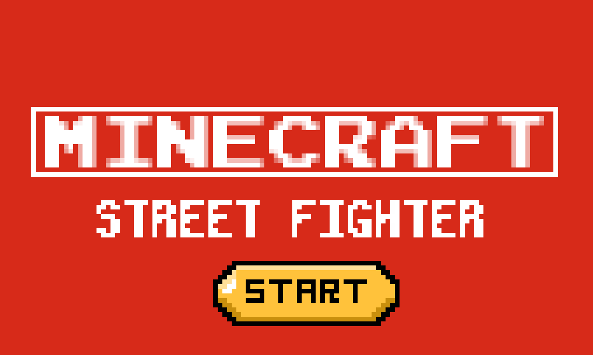
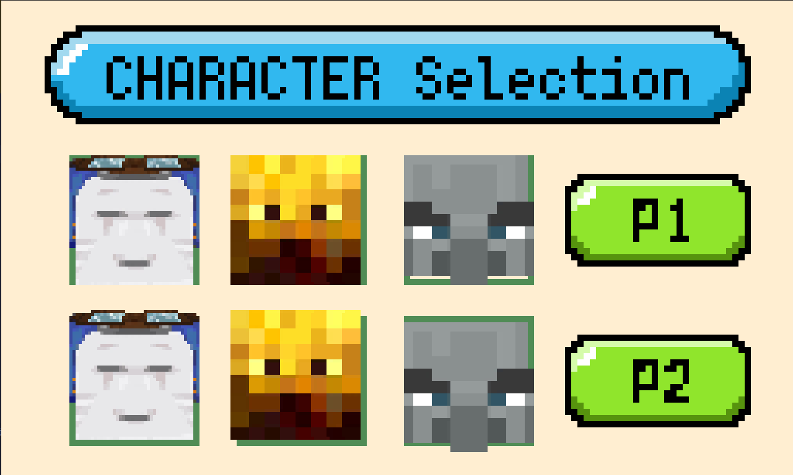
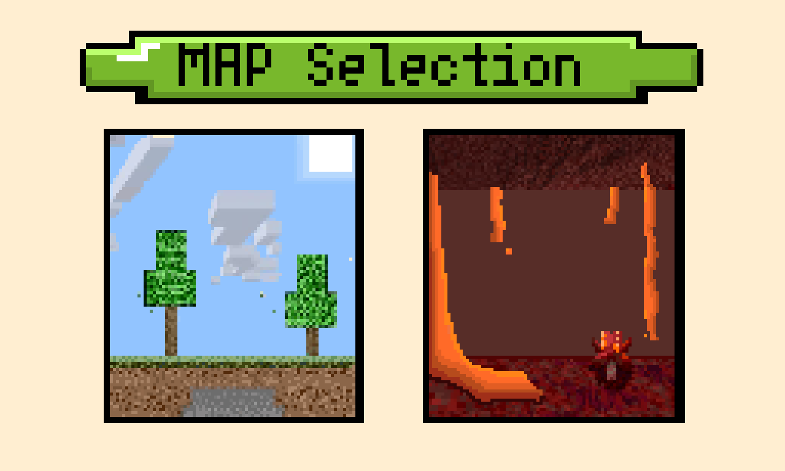
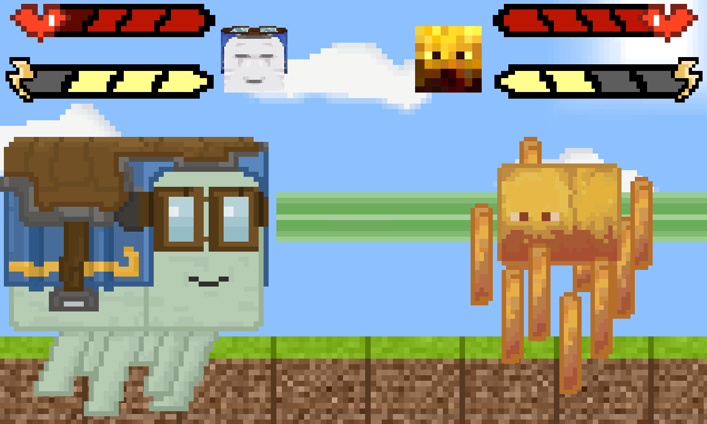
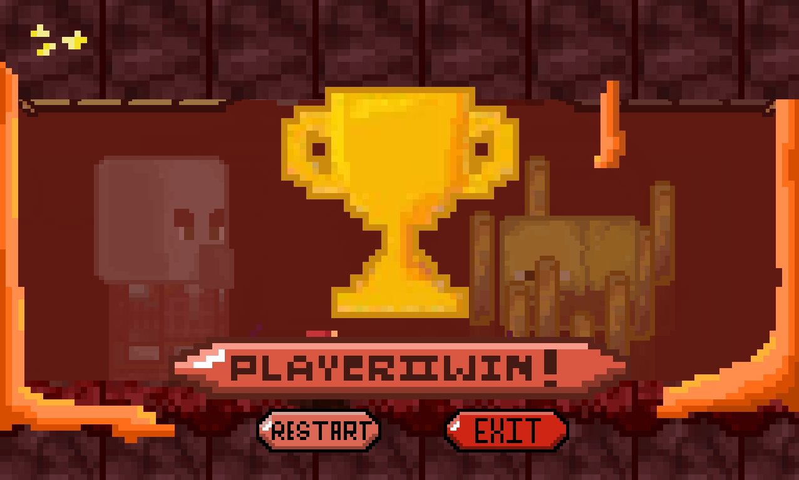

# __Minecraft Street Fighter__
Minecraft Street fighter is a game insipired by Street fighter and Minecraft for its sprites.
### Prerequisites
This Project is made in python using the pygame module, be sure to install it using
`pip install  pygame` for windows or venv
`sudo apt install python-pygame` for ubuntu system wide
### Usage
1. Clone the repository or download zip file
	 `git clone https://github.com/kattapis64/minecraftStreetFighter2.git`
2. Make sure the assets folder is in the same directory as the `fullGame.py`
3. Run `fullGame.py` with
`python fullGame.py`
### Information
The game consist of 3 Characters each has 3 Skills (Melee Ranged and Ultimate)
1. Happy Ghast
	1. Melee : Header
	2. Ranged : Snow ball
	3. Ultimate : Laser
2. Blaze
	1. Melee : Hit with Rod
	2. Ranged : Fireball
	3. Ultimate : Throw many rods
3. Pillager
	1. Melee : Axe Hit
	2. Ranged : Shoots Crossbow
	3. Ultimate : Turns into Ravager

### Show Case

Game Start Page

Character Selection

Map Selection

Ghast Skill

Ghast Wins

### Notes
This Project is built in python in 7 days.
The structure may seem odd compare to other polished Program
The original design of the Characters are owned by Mojang Studio 100%

### License
This project is licensed under the [MIT](LICENSE.txt) license